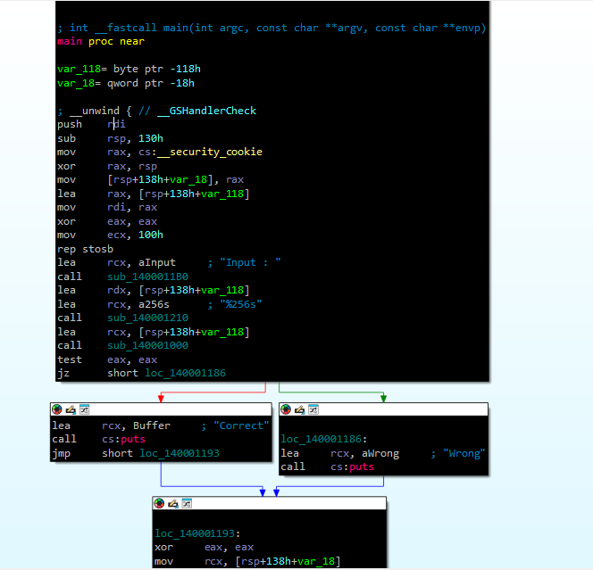
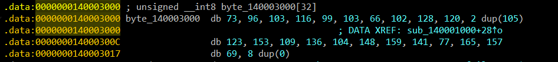

## beginner-03
Bài này cho chúng ta 1 file exe, mình dùng IDA để decompile thì được hàm `main` như dưới:


Mình thấy có hàm `input` --> bài này là dạng nhập input, rồi xử lí và so sánh input của mình, nếu đúng điều kiện thì trả về correct và ngược lại
Giờ mình cũng vô hàm kiểm tra nó để xem điều kiện và thấy như này(mình có sửa lại 1 xíu cho gọn hơn):
```c
__int64 __fastcall sub_140001000(__int64 a1){
  for ( int i = 0; (unsigned __int64)i < 24; ++i ){
    if ( byte_14[i] != (i ^ *(unsigned __int8 *)(a1 + i)) + 2 * i )
      return 0;
  }
  return 1;
}
```
Vậy là nó sẽ lấy i xor với input của mình rồi + `2*i` so với kí tự thứ i của mảng `byte_14`, nên sẽ có 2 trường hợp:
- 2 tụi nó khác nhau --> điều kiện đúng --> đi vào thân của if và trả về 0 --> sẽ out ra khỏi hàm
- 2 tụi nó giống nhau --> điều kiện sai --> không đi vô thân if mà tiến đến kiểm tra i+1 --> lần lượt đến hết vòng for và trả về 1

Kiểm tra mảng `byte_14`:

Nó là 1 mảng gồm 32 số `unsigned_int`, mình đã chuyển nó từ hex về dec cho dễ coi. Ở đây cần lưu ý chỗ `2 dup(155)` và `8 dup(0)`, cái hàm này nghĩa là bản copy của số bên trong nó --> `2 dup(155)` là 2 bản copy của 155 --> 155 155. Ban đầu mình ko biết nên tưởng hàm này là gì đó của hệ thống nên ở đây mình ghi 2 --> ko đủ byte trong mảng nên sai

Đã có đủ thông tin, giờ mình dịch ngược
```c
byte_14[i] != (i ^ *(unsigned __int8 *)(a1 + i)) + 2 * i
<=>byte_14[i] - 2*i = i ^ *(unsigned __int8 *)(a1 + i)
phép xor có thể từ a ^b = c --> b = a ^ c
<=>(i ^ (byte_14[i] - 2*i)) = *(unsigned __int8 *)(a1 + i)
```
Cũng cần chú ý thêm là `*(unsigned __int8 *)(a1 + i)` thật ra chính là input của mình, chứ ko phải lấy input mình +1. Lí giải cho việc này là vì a1 là cái base address của buffer chứa input. `*(unsigned __int8 *)(a1 + i)` nghĩa là:
- `(a+1)`: Dịch con trỏ a1 lên thêm i bytes.
- `(unsigned __int8 *)(a1 + i)`: Cast(ép kiểu - bắt compiler coi một ô nhớ hay con trỏ theo một kiểu dữ liệu khác) về con trỏ đến unsigned char (1 byte), tức là mỗi lần truy xuất chỉ lấy 1 byte. Nghĩa là mình nói với compiler: “giờ coi địa chỉ này như con trỏ unsigned __int8 *” nên nó sẽ biết mỗi lần deref sẽ lấy đúng 1 byte.
- Và khi dereference(nghĩa là lấy giá trị nằm tại địa chỉ mà con trỏ đó trỏ tới), ta lấy giá trị byte thứ i của buffer.

Trong C, ptr[i] thực chất được định nghĩa là *(ptr + i). Cho nên `((unsigned __int8 *)(a1 + i))` tương đương với `((unsigned __int8 *)a1)[i]` mà cái này chính là `a1[i]`.

Giải bằng script như sau:
```py
byte_140003000 = [73, 96, 103, 116, 99, 103, 66, 102, 128, 120, 
                  105, 105 # 2 dup(105) 
                  ,123, 153, 109, 136, 104, 148, 159, 141, 77, 165, 157, 69]
for i in range(0, 24):
    a1 = ((byte_140003000[i] - 2*i) ^ i) 
    print(chr(a1), end='')
# I_am_X0_xo_Xor_eXcit1ng
```